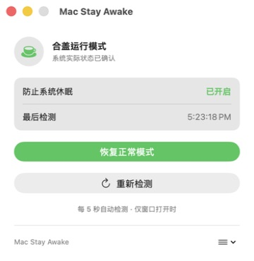

# Mac Stay Awake

A lightweight native macOS app that disables system sleep while long-running background tasks need to stay online. It stays available from both the Dock and the menu bar.

**[Download for macOS](https://github.com/kylerlam/mac-stay-awake/releases/latest)** · macOS 14 or later



*Actual app screenshot · Chinese interface · Sleep prevention enabled*

## Features

- Enable lid-closed operation with one click using macOS `pmset`.
- Restore normal sleep behavior at any time.
- Keep controls available in a standard, minimizable window and the menu bar.
- Show the verified system sleep-prevention status in the app without exposing command-line terminology.
- Recheck automatically while the window is visible or manually with the refresh button.

## Download and install

1. Download the `.dmg` from the [latest release](https://github.com/kylerlam/mac-stay-awake/releases/latest).
2. Open the disk image and drag **MacStayAwake.app** into **Applications**.
3. Launch **Mac Stay Awake**. Open its controls from the Dock or the cup icon in the menu bar.

## Requirements

- macOS 14 or later
- Xcode Command Line Tools with Swift 6 **only when building from source**; the downloaded app does not require Xcode.

## Build and run

```bash
./script/build_and_run.sh
```

The script builds the Swift package, creates `dist/MacStayAwake.app`, and launches the app bundle.

## Usage

1. Click the cup icon in the menu bar.
2. Click **开启合盖运行** to prevent system sleep.
3. Click **恢复正常模式** when the background task is complete.

The status card reads the current macOS value after every change. Green means the system value was verified, gray means normal sleep behavior is enabled, and orange means the requested and detected states do not match or the status could not be read.

Changing the mode requires administrator approval. The app verifies the system value before showing success and restores normal sleep behavior when you click **恢复正常模式**.

## Check system status

```bash
./script/status.sh
```

This runs `pmset -g | grep SleepDisabled`. A value of `1` means sleep is disabled; `0` means normal sleep behavior is enabled. The app reads the same value directly with `/usr/bin/pmset -g`.

## Lid-closed operation

Mac Stay Awake uses `pmset -a disablesleep 1`, which is the backend used by the tested version for keeping a MacBook running after the lid is closed. Keep the Mac connected to reliable power and networking for long-running tasks. macOS shutdowns, restarts, depleted power, thermal protection, application failures, and network interruptions can still take the computer or Codex offline.

## Development

```bash
swift test
./script/build_and_run.sh --verify
```
